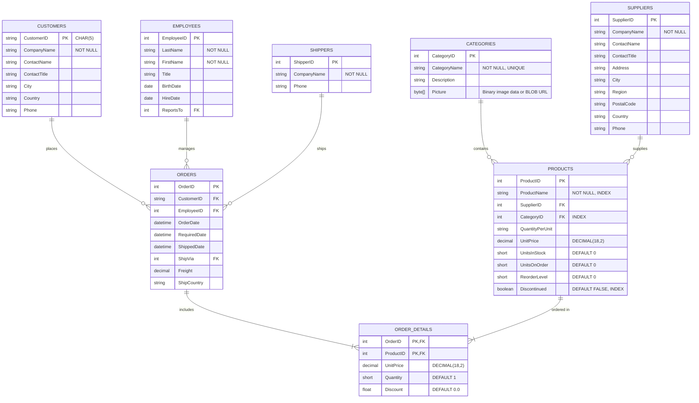

# Architectural Specification & Technical Blueprint: Asisya Dev I Solution

## 1. Executive Summary & Objective

This document outlines the formal Spec-Driven Development (SDD) blueprint for the **Finanzauto - Asisya Developer I** technical assessment. The objective is to design and implement an enterprise-grade, maintainable, scalable, and resilient distributed solution composed of:
- **Backend:** .NET 8 Web API adhering strictly to Clean/Hexagonal Architecture principles with CQRS (Command Query Responsibility Segregation).
- **Frontend:** React 18+ with TypeScript, Vite, TanStack Query, and a Modular (Feature-Sliced) Architecture implementing the Container-Presentational pattern.
- **Persistence & DevOps:** PostgreSQL 16+, Docker Compose multi-container orchestration, and automated GitHub Actions CI/CD workflows.

---

## 2. Relational Data Model (Northwind Domain)

The system models the core commerce domain based on the relational schema.

### 2.1 Entity Relationship Diagram



### 2.2 Deep Dive: Products - Categories Relationship & Image Storage

1. **Foreign Key Integrity:** `Products.CategoryID` references `Categories.CategoryID` with `ON DELETE RESTRICT`. A category cannot be deleted if products are associated with it.
2. **Category Photo Storage Architecture:**
   - **Legacy Northwind Context:** Legacy Northwind stores pictures as OLE Object arrays (`byte[]`) prepended with an 78-byte OLE header.
   - **Modern Production Approach:**
     - The database stores metadata and relative storage references (`PictureUrl` of type `VARCHAR(512)` or `PictureData` as clean base64/bytea for smaller embedded sets).
     - In our API, images uploaded via `POST /Category` can be handled via `IFormFile` (multipart/form-data) stored in an internal persistent volume or S3/MinIO compatible object store, exposing a public streaming endpoint `GET /api/v1/categories/{id}/photo` or serialized base64 data URI in `GET /api/v1/products/{id}`.
     - For compatibility with the evaluation schema, both `byte[]` (`bytea` in PostgreSQL) and a resolved URI property are mapped in the Domain/DTO layer.

---

## 3. Backend Architecture: Clean Architecture in .NET 8

To avoid the technical debt of anemic CRUD controllers and tight coupling to EF Core, the backend is organized into four decoupled concentric layers:

```
Asisya.Solution/
├── src/
│   ├── Asisya.Domain/           # Enterprise Business Rules (Entities, Value Objects, Domain Exceptions, Enums)
│   ├── Asisya.Application/      # Application Business Rules (CQRS, MediatR, DTOs, FluentValidation, Interfaces)
│   ├── Asisya.Infrastructure/   # External Concerns (EF Core DbContext, PostgreSQL, JWT Provider, Bulk Operations)
│   └── Asisya.WebApi/           # Entry Point (Controllers, Middlewares, Dependency Injection, Program.cs)
└── tests/
    ├── Asisya.Domain.Tests/
    ├── Asisya.Application.Tests/
    ├── Asisya.Infrastructure.Tests/
    └── Asisya.WebApi.IntegrationTests/
```

### 3.1 Architectural Justifications

#### Why PostgreSQL instead of SQL Server?
- **Licensing & TCO:** Zero commercial licensing overhead, eliminating costly SQL Server per-core licensing in cloud deployments.
- **Docker & Cloud-Native Ergonomics:** Instant spin-up in Linux containers with negligible memory footprint (~50MB idle vs SQL Server ~1.5GB).
- **Indexing & Full-Text Search:** Native support for `tsvector`, Trigram GIN indexes (`pg_trgm`), and composite B-tree indexes for lightning-fast autocomplete and filtering across millions of records.

#### Clean Architecture vs N-Tier / Anemic Architecture
- **Inversion of Control:** The core domain is independent of database drivers, ORMs, and web frameworks. If we swap EF Core for Dapper or Npgsql raw connections, domain business rules remain untouched.
- **Testability:** Every business rule and application use case can be tested in memory with isolated mocks or stubbed repository contracts.

---

## 4. API Endpoints Specification

### 4.1 POST `/api/v1/categories` (Create Category)
- **Content-Type:** `multipart/form-data`
- **Request Body:**
  - `name`: string (required, 2-50 chars, unique)
  - `description`: string (optional, max 255 chars)
  - `file`: binary file (optional, jpg/png/webp, max 2MB)
- **Validation:** FluentValidation rules enforce file MIME types and payload bounds.
- **Status Codes:** `201 Created` with `Location` header, `400 Bad Request` (ProblemDetails), `409 Conflict` (Duplicate category name).

### 4.2 POST `/api/v1/products/bulk` (Massive Product Upload)

#### Architectural Trade-Off Analysis: Batch Processing vs Message Queues

| Criterion | In-Process Batch Inserts (`NpgsqlBinaryImporter` / Batch EF) | Asynchronous Message Queue (RabbitMQ / Kafka + Background Worker) |
| :--- | :--- | :--- |
| **User Feedback** | **Immediate (Synchronous):** The client gets exact validation, total imported, and rejected row IDs in the HTTP response. | **Deferred (Asynchronous):** Requires polling (`GET /jobs/{id}`) or WebSocket push notifications for completion. |
| **Infrastructure Overhead** | **Zero additional infra:** Uses existing DB connection pool and transactional boundary. | **High:** Requires broker deployment, consumer fleet, Dead Letter Queues (DLQ), and orchestration. |
| **Failure Semantics** | **All-or-nothing (Atomic Transaction) or Partial Commit with Error Report** within one request scope. | Eventual consistency, distributed retry logic, idempotent consumers required. |
| **Throughput Suitability** | Optimal for files up to **50,000 records** (executed in < 1.5 seconds via PostgreSQL binary copy). | Ideal for massive streams (> 100,000+ records) taking minutes to process. |

**Architectural Decision:**
- For standard assessment and enterprise operational requirements up to 25,000 records per upload, an **atomic batch insert strategy** using `NpgsqlBinaryImporter` (`COPY ... FROM STDIN (FORMAT BINARY)`) or chunked `AddRangeAsync` + `SaveChangesAsync` with `DbContext.Database.BeginTransactionAsync()` is chosen.
- A batch size of **1,000 records** per batch is applied to avoid saturating SQL parameter limits (PostgreSQL max 65,535 parameters) and LOH (Large Object Heap) pressure in .NET memory.
- If the business requires asynchronous ingestion in the future, the design abstracts the handler behind an `IProductBulkIngestionService`, allowing a drop-in replacement with MassTransit + RabbitMQ without modifying controller contracts.

**Response Structure (`200 OK` or `207 Multi-Status`):**
```json
{
  "totalProcessed": 1250,
  "successfulImports": 1248,
  "failedImports": 2,
  "errors": [
    { "row": 14, "productName": "Invalid SKU", "reason": "CategoryID 999 does not exist." }
  ],
  "executionTimeMs": 340
}
```

### 4.3 GET `/api/v1/products` (Search, Filters, Server-Side Pagination)
- **Query Parameters:**
  - `page`: integer (default: 1, min: 1)
  - `pageSize`: integer (default: 10, min: 1, max: 100)
  - `searchTerm`: string (optional, fuzzy search on `ProductName`)
  - `categoryId`: integer (optional, exact match)
  - `minPrice` / `maxPrice`: decimal (optional)
  - `discontinued`: boolean (optional)
  - `sortBy`: string (`name`, `price`, `stock`, default: `name`)
  - `sortOrder`: string (`asc`, `desc`, default: `asc`)
- **Query Performance Strategy:**
  - `IQueryable` expression trees dynamic composition via EF Core.
  - Asynchronous streaming with `AsNoTracking()`.
  - Splitting count query (`CountAsync()`) and data retrieval (`Skip().Take().ToListAsync()`) into an optimized CTE or parallel tasks.
- **Response Structure:**
```json
{
  "items": [
    {
      "productId": 1,
      "productName": "Chai",
      "categoryId": 1,
      "categoryName": "Beverages",
      "unitPrice": 18.00,
      "unitsInStock": 39,
      "discontinued": false
    }
  ],
  "pageIndex": 1,
  "pageSize": 10,
  "totalItems": 77,
  "totalPages": 8,
  "hasPreviousPage": false,
  "hasNextPage": true
}
```

### 4.4 GET `/api/v1/products/{id}` (Detail with Category Photo)
- Returns complete product details along with category metadata and the category photo data:
```json
{
  "productId": 1,
  "productName": "Chai",
  "supplier": {
    "supplierId": 1,
    "companyName": "Exotic Liquids"
  },
  "category": {
    "categoryId": 1,
    "categoryName": "Beverages",
    "description": "Soft drinks, coffees, teas, beers, and ales",
    "pictureUrl": "/api/v1/categories/1/photo",
    "pictureBase64": "data:image/jpeg;base64,/9j/4AAQSkZJRg..."
  },
  "quantityPerUnit": "10 boxes x 20 bags",
  "unitPrice": 18.00,
  "unitsInStock": 39,
  "unitsOnOrder": 0,
  "reorderLevel": 10,
  "discontinued": false
}
```

---

## 5. Security Architecture (JWT & RBAC)

1. **Token Flow:**
   - **Access Token:** Short-lived JWT (15 minutes lifespan) containing claims (`sub`, `email`, `role`, `jti`). Signed via HMAC-SHA256 using an environment-injected cryptographic secret (minimum 256 bits).
   - **Refresh Token:** Cryptographically random 64-byte string stored hashed in the database, with a 7-day expiration and atomic rotation on every renewal to prevent replay attacks.
2. **Transport Security:**
   - HTTPS mandatory with HSTS headers enabled.
   - Anti-forgery protections and CORS policies strictly allowing authorized origins.
3. **Role-Based Access Control (RBAC):**
   - `Admin`: Full permissions (Bulk upload, category creation/updates, product modifications).
   - `Operator`: Product queries, updates, view category photos.
   - `Reader`: Read-only access to catalog.
4. **Password Storage:** ASP.NET Core `IPasswordHasher<T>` utilizing PBKDF2 with HMAC-SHA512 (100,000 iterations) or BCrypt (work factor 12).

---

## 6. Frontend Architecture (React + TypeScript)

### 6.1 Modular (Feature-Sliced) Directory Structure

```
asisya-client/
├── public/
├── src/
│   ├── app/                      # Providers, Router, App root
│   │   ├── App.tsx
│   │   ├── router.tsx
│   │   └── providers.tsx
│   ├── shared/                   # Cross-cutting agnostic code
│   │   ├── api/                  # Axios instance, interceptors, error handling
│   │   ├── components/           # Atomic UI (Button, Modal, Input, Table, Spinner)
│   │   ├── hooks/                # useDebounce, usePagination, useToast
│   │   └── utils/                # Formatters, constants
│   ├── modules/
│   │   ├── auth/                 # Authentication slice (Login, authContext/Zustand, guard)
│   │   ├── categories/           # Category slice (CategoryFormModal, useCategories)
│   │   └── products/             # Product catalog slice
│   │       ├── api/              # productEndpoints.ts (GET, POST bulk)
│   │       ├── components/       # Presentational: ProductTable, ProductFilter, BulkDropzone
│   │       ├── containers/       # Containers: ProductCatalogContainer, ProductDetailContainer
│   │       ├── hooks/            # useProductsQuery, useBulkUploadMutation
│   │       └── types/            # product.types.ts
│   └── main.tsx
├── Dockerfile
├── nginx.conf
└── vite.config.ts
```

### 6.2 Architectural Justifications for Frontend

- **Container - Presentational Pattern:**
  - *Presentational Components:* Pure functions (`ProductTable`, `ProductFilterBar`). They have no dependencies on HTTP clients or global stores; they receive `props` and emit events. This allows 100% isolated unit testing and visual testing in Storybook.
  - *Container Components:* Orchestrate hooks (`useProductsQuery`), handle errors, handle pagination state, and feed data down to presentational components.
- **Server State vs Client State Separation:**
  - **Server State:** Managed via **TanStack Query (React Query)**. Handles caching, background re-fetching, pagination pre-fetching, and optimistic updates. Avoids polluting global stores with server data.
  - **Client State:** Managed via **Zustand** for lightweight local authentication and session tokens.
- **Vite Bundler:** ESM-native development server with sub-second Hot Module Replacement (HMR) and optimized Rollup tree-shaking production builds.

---

## 7. Testing Strategy & Test Automation Pyramid

### 7.1 Backend Testing
1. **Unit Testing:**
   - Framework: `xUnit`, `FluentAssertions`, `NSubstitute`.
   - Coverage: Domain entities, Value Objects, MediatR command handlers, and FluentValidation rules.
   - Isolation: No database or network calls; execution runs in < 2 seconds.
2. **Integration Testing:**
   - Framework: `Microsoft.AspNetCore.Mvc.Testing` (`WebApplicationFactory<Program>`) + `Testcontainers.PostgreSql`.
   - Functionality: Boots an ephemeral PostgreSQL container inside Docker per test suite, runs EF Core migrations, and executes real HTTP requests against endpoints verifying data persistence, status codes, and database transactions.
3. **Architecture Rules (NetArchTest):**
   - Enforce architectural integrity: Ensures `Domain` does not reference `Infrastructure` or `WebApi`, and Controllers only dispatch MediatR commands/queries.

### 7.2 Frontend Testing
1. **Unit & Component Testing:**
   - Framework: `Vitest` + `React Testing Library` + `@testing-library/user-event`.
   - Mocking: `MSW` (Mock Service Worker) intercepts network requests at the browser service-worker layer, ensuring real Axios interceptors are exercised.
2. **End-to-End (E2E) Testing:**
   - Framework: `Playwright`.
   - Critical path testing: User logs in -> navigates to Catalog -> filters by category -> opens Bulk Upload modal -> uploads CSV/JSON -> table refreshes with new products.

---

## 8. Dockerization & CI/CD Pipeline

### 8.1 Docker Compose Full-Stack Orchestration

```yaml
version: '3.8'

services:
  postgres:
    image: postgres:16-alpine
    container_name: asisya-postgres
    restart: always
    environment:
      POSTGRES_DB: asisya_db
      POSTGRES_USER: asisya_user
      POSTGRES_PASSWORD: asisya_password
    ports:
      - "5432:5432"
    volumes:
      - pgdata:/var/lib/postgresql/data
    healthcheck:
      test: ["CMD-SHELL", "pg_isready -U asisya_user -d asisya_db"]
      interval: 5s
      timeout: 5s
      retries: 5

  backend:
    build:
      context: ./backend
      dockerfile: Dockerfile
    container_name: asisya-backend
    restart: on-failure
    depends_on:
      postgres:
        condition: service_healthy
    environment:
      - ASPNETCORE_ENVIRONMENT=Development
      - ConnectionStrings__DefaultConnection=Host=postgres;Port=5432;Database=asisya_db;Username=asisya_user;Password=asisya_password
    ports:
      - "5000:8080"

  frontend:
    build:
      context: ./frontend
      dockerfile: Dockerfile
    container_name: asisya-frontend
    restart: always
    depends_on:
      - backend
    ports:
      - "3000:80"

volumes:
  pgdata:
```

### 8.2 GitHub Actions CI/CD Workflow (`.github/workflows/ci.yml`)

```yaml
name: Asisya Continuous Integration

on:
  push:
    branches: [ main, dev ]
  pull_request:
    branches: [ main, dev ]

jobs:
  backend-ci:
    name: Backend Build & Test (.NET 8)
    runs-on: ubuntu-latest
    steps:
      - name: Checkout Code
        uses: actions/checkout@v4

      - name: Setup .NET 8 SDK
        uses: actions/setup-dotnet@v4
        with:
          dotnet-version: '8.0.x'

      - name: Restore Dependencies
        run: dotnet restore Asisya.Solution.sln

      - name: Build Solution
        run: dotnet build Asisya.Solution.sln --no-restore --configuration Release

      - name: Run Unit & Integration Tests
        run: dotnet test Asisya.Solution.sln --no-build --configuration Release --verbosity normal --collect:"XPlat Code Coverage"

  frontend-ci:
    name: Frontend Build & Test (React)
    runs-on: ubuntu-latest
    steps:
      - name: Checkout Code
        uses: actions/checkout@v4

      - name: Setup Node.js 20
        uses: actions/setup-node@v4
        with:
          node-version: 20
          cache: 'npm'
          cache-dependency-path: frontend/package-lock.json

      - name: Install Dependencies
        working-directory: ./frontend
        run: npm ci

      - name: Lint Code
        working-directory: ./frontend
        run: npm run lint

      - name: Run Vitest Unit Tests
        working-directory: ./frontend
        run: npm run test:run

      - name: Build Production Assets
        working-directory: ./frontend
        run: npm run build
```

---

## 9. Next Steps (SDD Execution Roadmap)

1. **Phase 1 (Domain & Persistence):** Generate .NET 8 solution structure, Domain Entities, EF Core Migrations, and PostgreSQL initial seed.
2. **Phase 2 (Application & CQRS):** Implement MediatR commands/queries for Categories and Products, FluentValidation, and the high-performance bulk upload service.
3. **Phase 3 (Security & Presentation API):** Implement JWT Auth handlers, Swagger documentation, and RFC 7807 ProblemDetails middleware.
4. **Phase 4 (Modular Frontend):** Scaffold Vite React application, TanStack Query integration, Catalog UI with pagination/filtering, and the Bulk Upload modal.
5. **Phase 5 (Testing & Docker Delivery):** Complete Testcontainers integration tests, Docker Compose validation, and final PR verification.
